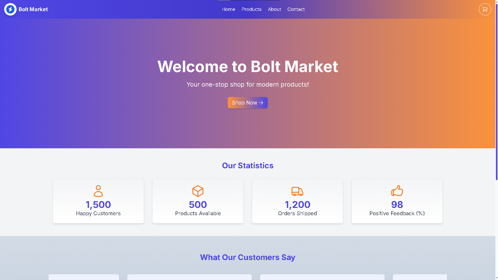
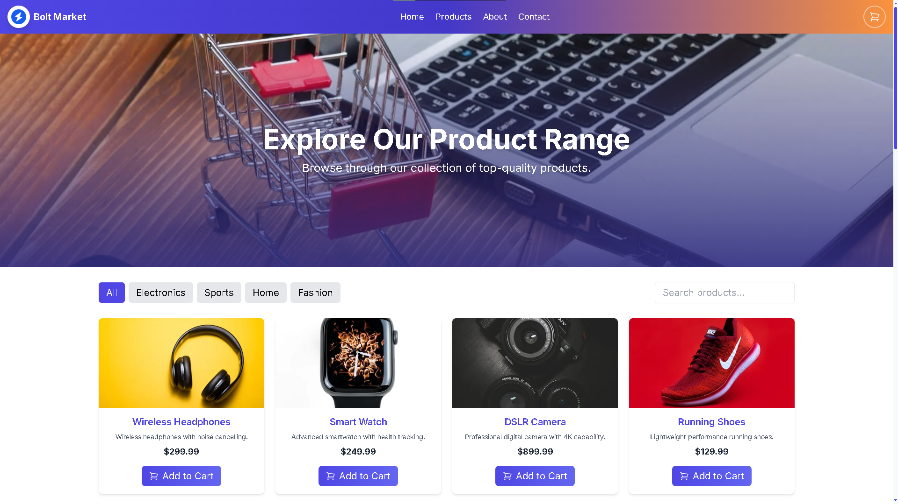
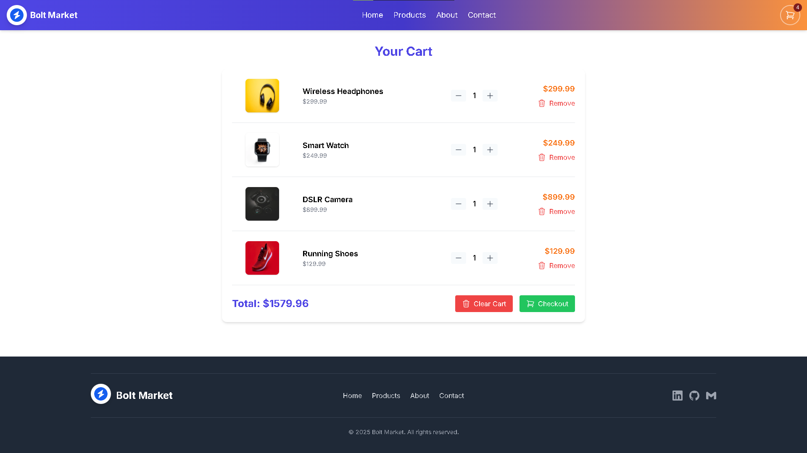
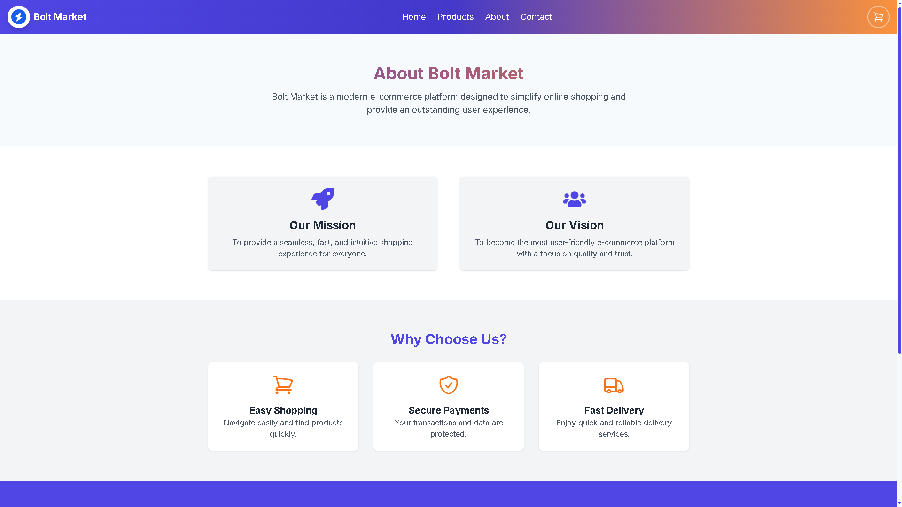
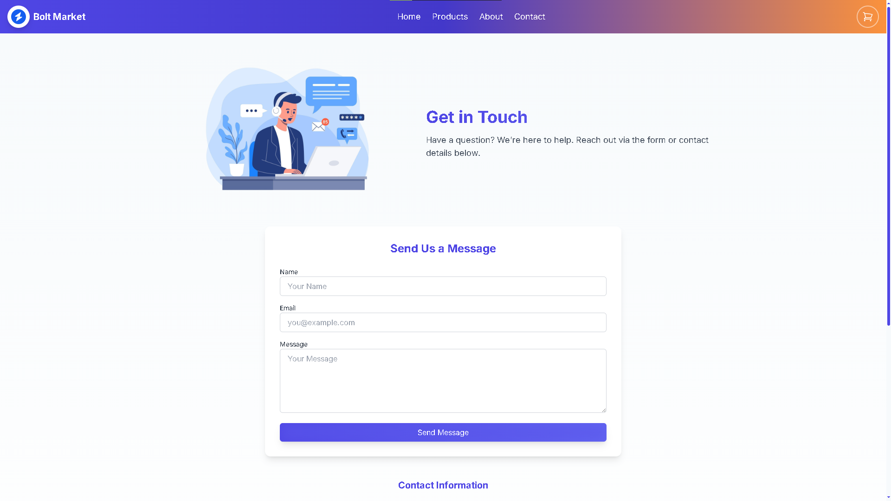

[](https://github.com/nenad0707/Bolt-Market/actions/workflows/deploy-boltmarket.yml)

# 🛒 Bolt Market - Modern E-Commerce Platform


**Bolt Market** is a modern, responsive e-commerce platform built with **React**, **TypeScript**, and **Tailwind CSS**. Featuring smooth animations powered by **Framer Motion**, Bolt Market offers an intuitive shopping experience with a clean, user-friendly interface.

## 📋 Table of Contents

- [🛒 Bolt Market - Modern E-Commerce Platform](#-bolt-market---modern-e-commerce-platform)
  - [📋 Table of Contents](#-table-of-contents)
  - [✨ Features](#-features)
  - [🚀 Live Demo](#-live-demo)
  - [🖼️ Screenshots](#️-screenshots)
  - [🛠️ Tech Stack](#️-tech-stack)
  - [📁 Project Structure](#-project-structure)
  - [🧩 Core Components](#-core-components)
  - [🔄 State Management](#-state-management)
  - [💻 Getting Started](#-getting-started)
    - [Prerequisites](#prerequisites)
    - [Installation](#installation)
    - [Available Scripts](#available-scripts)
  - [🌥️ Deployment](#️-deployment)
    - [Azure Static Web Apps](#azure-static-web-apps)
    - [GitHub Actions Workflows](#github-actions-workflows)
  - [📱 Responsive Design](#-responsive-design)
  - [🎨 Design Features](#-design-features)
  - [📄 License](#-license)
  - [👨‍💻 Author](#-author)

## ✨ Features

- **🏠 Interactive Homepage**: Engaging hero section with animated elements
- **🛍️ Product Catalog**: Browse products with filtering by category and search functionality
- **🛒 Shopping Cart**: Add, remove, and update item quantities in real-time
- **📊 Statistics Display**: Animated counters showcasing key metrics
- **👥 Customer Testimonials**: Carousel of customer reviews with smooth animations
- **📱 Fully Responsive**: Optimized for all screen sizes with a mobile-first approach
- **🌗 Smooth Page Transitions**: Seamless navigation between pages using Framer Motion
- **📋 Contact Form**: Easy-to-use contact form for customer inquiries
- **🔍 About Page**: Company information with mission and vision statements
- **⬆️ Back to Top Button**: Convenient one-click scroll to top functionality

## 🚀 Live Demo

[](https://nice-mud-0ede4fd0f.4.azurestaticapps.net/)

> Deployment is managed through Azure Static Web Apps and GitHub Actions.

## 🖼️ Screenshots

### 🏠 Homepage


### 🛍️ Products Page


### 🛒 Shopping Cart


### 📝 About Page


### 📞 Contact Page


## 🛠️ Tech Stack

- **Frontend Framework**: React 18
- **Programming Language**: TypeScript
- **Build Tool**: Vite
- **Styling**: Tailwind CSS
- **Animations**: Framer Motion
- **Routing**: React Router DOM v7
- **Icons**: Heroicons, React Icons
- **Notifications**: React Toastify
- **Deployment**: Azure Static Web Apps
- **Infrastructure as Code**: Bicep (Azure)
- **CI/CD**: GitHub Actions

## 📁 Project Structure

```
bolt-market/
├── src/
│   ├── assets/       # Images and static assets
│   ├── components/   # Reusable UI components
│   ├── context/      # React context (Cart state)
│   ├── data/         # Static data (products)
│   ├── pages/        # Page components
│   └── App.tsx       # Main application component
├── public/           # Public assets
│   └── images/       # Product images
├── infrastructure/   # Azure deployment resources
│   ├── main.bicep    # Bicep template
│   └── setup-boltmarket.ps1 # Azure setup script
└── .github/workflows # GitHub Actions CI/CD
```

## 🧩 Core Components

- **Navbar**: Responsive navigation bar with animated mobile menu
- **Hero**: Eye-catching homepage hero section with parallax effects
- **ProductList**: Filterable, searchable product grid
- **ProductCard**: Individual product display with add-to-cart functionality
- **CartPage**: Interactive shopping cart with quantity controls
- **AnimatedRoutes**: Page transition animations
- **Testimonials**: Auto-scrolling customer reviews
- **Statistics**: Animated counters with icons
- **Footer**: Site navigation and social links

## 🔄 State Management

Bolt Market uses React Context API for state management:

- **CartContext**: Manages shopping cart state including:
  - Adding items to cart
  - Updating item quantities
  - Removing items
  - Calculating total price

## 💻 Getting Started

### Prerequisites

- Node.js (version 16 or later)
- npm or yarn

### Installation

1. Clone the repository:
```bash
git clone https://github.com/nenad0707/Bolt-Market.git
cd Bolt-Market
```

2. Install dependencies:
```bash
npm install
# or
yarn install
```

3. Start the development server:
```bash
npm run dev
# or
yarn dev
```

4. Open your browser and navigate to [http://localhost:5173](http://localhost:5173)

### Available Scripts

- `npm run dev` - Start development server
- `npm run build` - Build for production
- `npm run preview` - Preview production build locally
- `npm run lint` - Run ESLint to check code quality

## 🌥️ Deployment

### Azure Static Web Apps

The application is deployed to Azure Static Web Apps, which provides:
- Global CDN distribution
- Free SSL certificates
- GitHub integration
- Custom domain support

### GitHub Actions Workflows

Two main workflows are configured:

1. **deploy-boltmarket.yml**: Builds and deploys the application to Azure Static Web Apps
2. **deploy-bicep.yml**: Provisions Azure resources using Bicep templates

## 📱 Responsive Design

- **Mobile-First Approach**: Designed for all screen sizes
- **Adaptive Layouts**: Flexbox and CSS Grid for responsive organization
- **Touch-Optimized**: Controls designed for both mouse and touch interaction
- **Hamburger Menu**: Collapsible navigation menu for mobile devices

## 🎨 Design Features

- **Custom Color Scheme**: Indigo blue and orange accent colors
- **Smooth Animations**: Page transitions and interactive elements
- **Gradient Backgrounds**: Modern gradient effects for visual appeal
- **Custom Scrollbar**: Styled scrollbar matching the theme colors
- **Card-Based UI**: Clean card components for products and information
- **Responsive Typography**: Font sizes adjust based on screen width
- **Shadow Effects**: Subtle shadows for depth and hierarchy

## 📄 License

This project is licensed under the MIT License - see the [LICENSE](LICENSE) file for details.

## 👨‍💻 Author

Created by [Nenad Ristić](https://github.com/nenad0707)

---

📌 **Note**: This project is for demonstration purposes only and does not process actual payments or store real user data.
